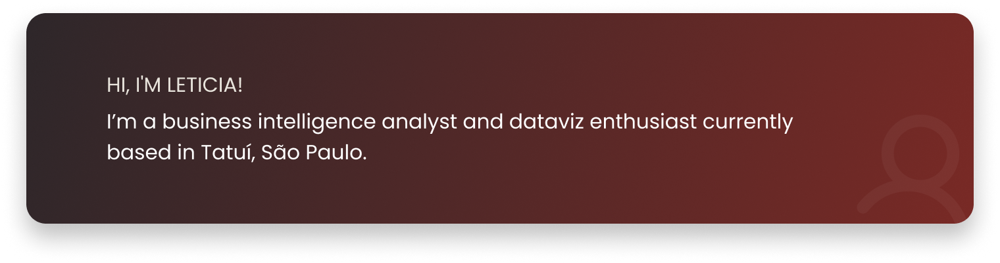

  

 

  
  &nbsp;
  
  &nbsp;

 

## ✦ Featured Projects

 

<table align="center" width="100%">
  <tr>
    <td width="50%" valign="top">
       
      
        
      <b>Brazil Trading with the World</b> 
      Business Intelligence &nbsp;|&nbsp; Data Visualization
        
    </td>
    <td width="50%" valign="top">
       
      
        
      <b>Mercado Solidário</b> 
      PHP · SQL · HTML/CSS · JS · WordPress &nbsp;|&nbsp; Full-Stack Web
        
    </td>
  </tr>
  <tr>
    <td width="50%" valign="top">
       
      
        
      <b>Investigating 1990s Movies 🎬</b> 
      NumPy · Matplotlib · Seaborn &nbsp;|&nbsp; Exploratory Data Analysis
        
    </td>
    <td width="50%" align="center" valign="middle">
       
      <i>More projects coming soon...</i>
       
    </td>
  </tr>
</table>

 

---

  Made with ♥ and ☕︎ by Leticia Stahl 

 

