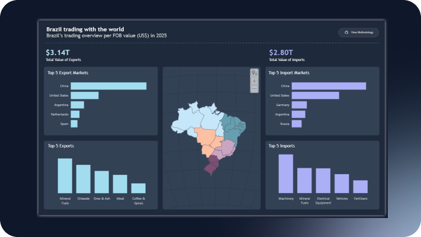
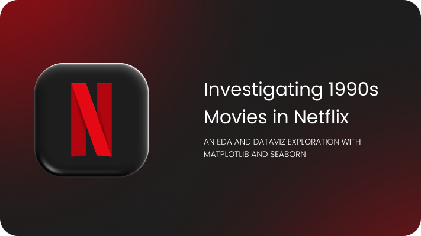

&nbsp;

```python
quote = {
    "text": "Data is a gift from yesterday that you receive today to make tomorrow better.",
    "author": "Jon Acuff"
}

print(f'"{quote["text"]}" — {quote["author"]}')
```

<br/>

## Hi, I'm Letícia 👋

I'm a **Business Intelligence Analyst** and **Data Visualization Enthusiast** based in Tatuí, SP, Brazil.

This is my space to build, experiment and learn. <br>
You'll find college projects, personal explorations and tools I wanted to dig into. Everything here is original work. When a project is inspired by a course, tutorial or someone else's idea, I always credit the source.

You can also find me at:

<a href="https://www.linkedin.com/in/leticiastahl/">
  
</a>
&nbsp;
<a href="https://www.behance.net/leticiastahl">
  
</a>
&nbsp;
<a href="https://medium.com/@devleticiagoes">
  
</a>

<br/><br/>

### ✦ Featured Projects

<br/>

<table width="100%">
  <tr>
    <td width="33%" valign="top">
      <a href="https://github.com/devleticiastahl/brazil-trading-with-the-world-2025">
        
      </a>
      <br/><br/>
      <b>Brazil Trading with the World</b><br/>
      <sub>Business Intelligence · Data Visualization</sub><br/>
      <sub>Analysis of Brazilian trade flows with interactive dashboards built in Power BI.</sub>
      <br/><br/>
    </td>
    <td width="33%" valign="top">
      <a href="https://github.com/devleticiastahl/90smovies-netflix">
        
      </a>
      <br/><br/>
      <b>Investigating 1990s Movies</b><br/>
      <sub>NumPy · Matplotlib · Seaborn · Exploratory Data Analysis</sub><br/>
      <sub>EDA on Netflix's 90s movie catalog, uncovering patterns in genres, ratings and duration.</sub>
      <br/><br/>
    </td>
    <td width="33%" valign="top">
      <a href="https://github.com/edunucleo/mercado_solidario">
        
      </a>
      <br/><br/>
      <b>Mercado Solidário</b><br/>
      <sub>PHP · SQL · HTML/CSS · JS · WordPress · Full-Stack Web</sub><br/>
      <sub>A web platform built to support a local solidarity market, enabling donations, volunteering sign-ups, family registrations, and an admin panel for stock management and scoring.</sub>
      <br/><br/>
    </td>
  </tr>
</table>

<br/>

---

<sub>Made with ♥ and ☕︎ by Leticia Góes</sub>
