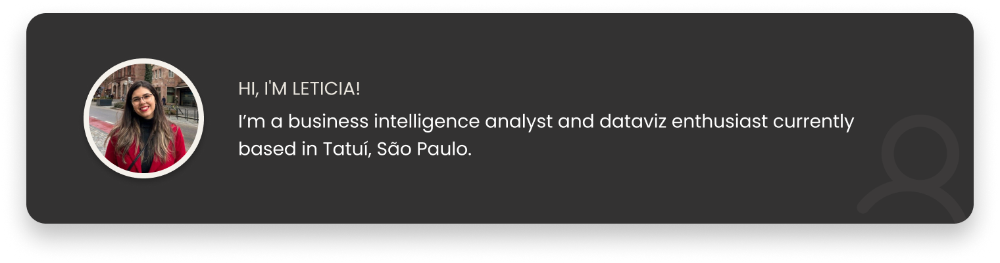

  

 

  
  &nbsp;
  
  

 

---

## ✦ Featured Projects

 

  <table>
    <tr>
      <td align="center" width="50%">
        
          
        <b>Brazil Trading with the World</b>
         
        Business Intelligence · Data Visualization
      </td>
      <td align="center" width="50%">
        
          
        <b>Mercado Solidário</b>
         
        php, sql, html/css, js, & wordpress · Full-Stack Web Development
      </td>
    </tr>
    <tr>
      <td align="center" width="50%">
        
          
        <b>Investigating 1990s Movies 🎬</b>
         
        numpy, matplotlib, seaborn · Exploratory Data Analysis
      </td>
      <td align="center" width="50%">
        <!-- próximo projeto -->
      </td>
    </tr>
  </table>

 

---

  Made with ♥ by Leticia Stahl

